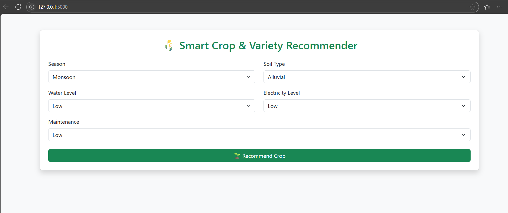
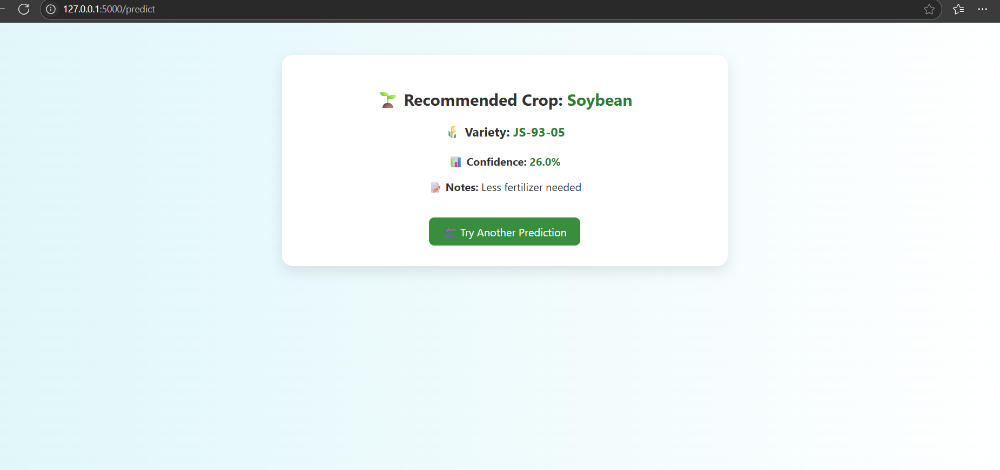

# 🌾 Smart Crop & Variety Recommendation System

This project recommends the most suitable **Crop + Variety** based on inputs like:

- 🌦️ Season
- 🌱 Soil Type
- 💧 Water Availability
- ⚡ Electricity Access
- 🛠️ Maintenance Level

It helps farmers choose the **best crop and variety** for maximum yield and sustainability using machine learning.

---

## 🔧 Tech Stack

| Tool           | Purpose                       |
|----------------|-------------------------------|
| Python         | Core backend + model training |
| Flask          | Web app framework             |
| Pandas         | Data preprocessing            |
| scikit-learn   | Model training (RandomForest) |
| HTML/CSS       | Frontend UI                   |
| Bootstrap      | Styling                       |

---

## 📥 User Inputs

| Feature         | Values                          |
|-----------------|----------------------------------|
| Season          | Monsoon / Summer / Winter        |
| Soil Type       | Alluvial / Black / Loamy         |
| Water Level     | Low / Medium / High              |
| Electricity     | Low / Medium / High              |
| Maintenance     | Low / Medium / High              |

---

## 🧠 Output

- ✅ **Best Crop**
- 🌾 **Recommended Variety**
- 📝 **Farming Notes**
- 📊 **Prediction Confidence**

---

## 🖼️ Demo Screenshots

### 🔘 Input Form


### ✅ Prediction Result


---

## 🚀 How to Run Locally

```bash
# Step 1: Clone the repo
git clone https://github.com/Suryabhan-Patel/Smart-Crop-Recommendation-System.git
cd your-repo-name

# Step 2: Install dependencies
pip install -r requirements.txt

# Step 3: Train the model
cd backend
python train_model.py

# Step 4: Run the Flask app
python app.py

# Step 5: Open in browser
Go to http://127.0.0.1:5000/
